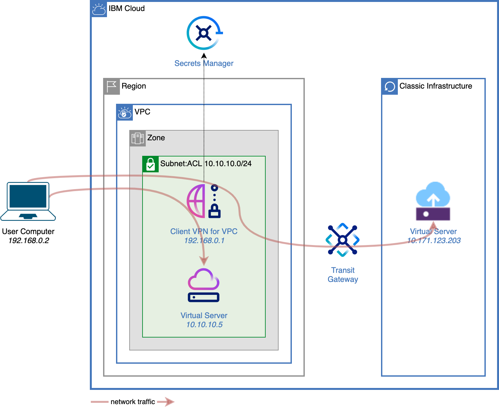

# Use Client-to-Site VPN to securely access your IBM Cloud resources

Virtual Private Cloud (VPC) come with an additional layer of security as your workload can be completely hidden from the public Internet. But there are times when you will want to get into this private network. A common practice is to use a bastion host to jump into your VPC from your local machine as example. Another option is to use a Client-to-Site VPN software inside your VPC to extend the secure VPC network to your local network.

This repo shows how to configure and provision [Client VPN for VPC](https://cloud.ibm.com/docs/vpc?topic=vpc-vpn-client-to-site-overview).



## Prerequisites

To configure Client VPN for VPC, you will need:
* your IBM Cloud API key,
* the ID of an existing Secrets Manager instance.

In addition, to test the connectivity with VSI and Classic Infrastructure, you will need:
* your IBM Cloud Classic Infrastructure (SoftLayer) user name,
* your IBM Cloud Classic Infrastructure API key,
* the name of an existing SSH key in VPC,
* the name of an existing SSH key in Classic Infrastructure.

## Prepare your environment

1. Copy `template.local.env` to `local.env`:
   ```sh
   cp template.local.env local.env
   ```
1. Edit `local.env` to match your environment.
1. Use the [following Docker image](https://github.com/l2fprod/ibmcloud-ci) to run the deployment scripts. It has all required tools preinstalled.
   * On Linux terminal:
      ```sh
      docker run -it --volume $PWD:/root/mnt/home --workdir /root/mnt/home l2fprod/ibmcloud-ci
      ```
   * On Windows command prompt:
      ```sh
      docker run -it --volume %CD%:/root/mnt/home --workdir /root/mnt/home l2fprod/ibmcloud-ci
      ```
   You can also try with your own environment. Prereqs are: tfswitch, terraform.
1. Run `tfswitch` to point to the right Terraform version for this solution:
   ```
   tfswitch
   ```
1. Load the environment:
   ```sh
   source local.env
   ```

## Configure server and client certificates

1. Generate server and client certificates and create them as secrets in Secrets Manager:
   ```sh
   (cd 010-certificates && ./main.sh apply)
   ```

## Provision Client VPN for VPC

1. Create a VPC and a Client VPN for VPC instance:
   ```sh
   (cd 020-infrastructure && ./main.sh apply)
   ```
1. At that stage, you can already establish an OpenVPN connection to validate the Client VPN creation. Use the OpenVPN user interface or the command line (from your machine, not the Docker container above) with the generated configuration file [config/client-full.ovpn](./config/client-full.ovpn) that includes all required certificates and key.
   ```
   sudo openvpn --config config/client-full.ovpn
   ```

   You should see the message `Initialization Sequence Completed`. The output also includes information about the server configuration, the routes that were pushed to the client.
1. Leave the VPN connection running

## Test connectivity

1. Create a VSI in VPC, a VSI in Classic and a Transit Gateway to connect them:
   ```sh
   (cd 030-test-connectivity && ./main.sh apply)
   ```
1. Ping or `ssh` to the VSIs that were created using the IP addresses shown at the end of the provisioning.

## Destroy all resources

1. Deploy all resources:
   ```sh
   yes yes | ./doit.sh destroy
   ```

## Code structure

| File or folder | Description |
| -------------- | ----------- |
| [010-certificates](./010-certificates/) | Generates server and client certificates and stores them in Secrets Manager. |
| [020-infrastructure](./020-infrastructure/) | Creates a VPC and a Client VPN for VPC instance. |
| [030-test-connectivity](./030-test-connectivity/) | Creates a VSI in VPC and in Classic to test the connectivity from your local machine. |

## License

See [LICENSE](./LICENSE).
